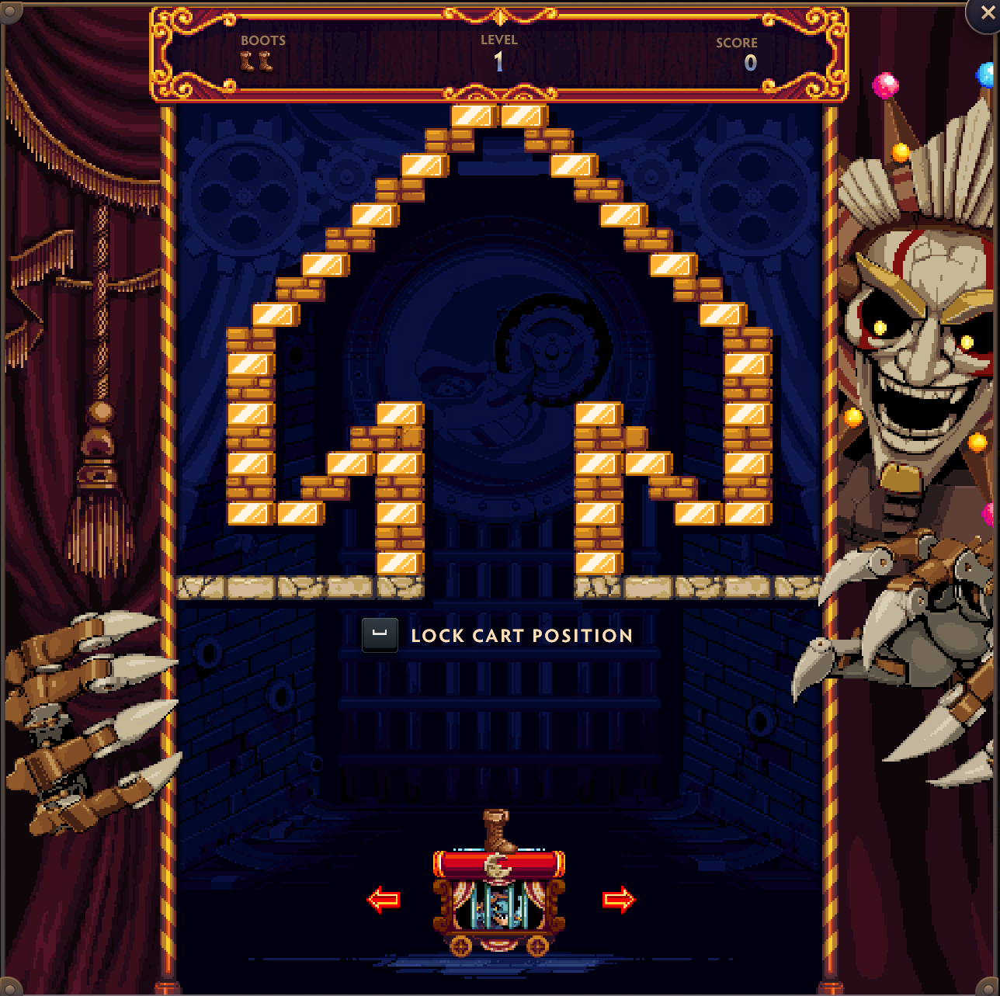
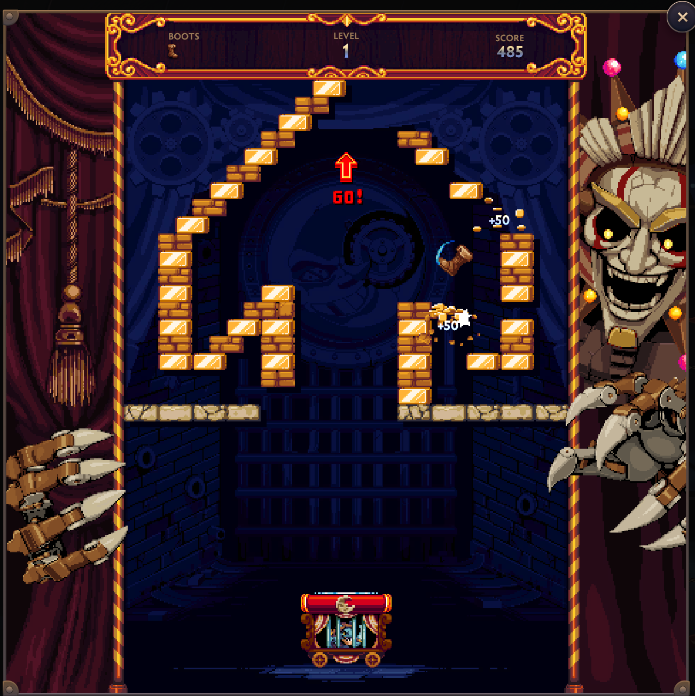
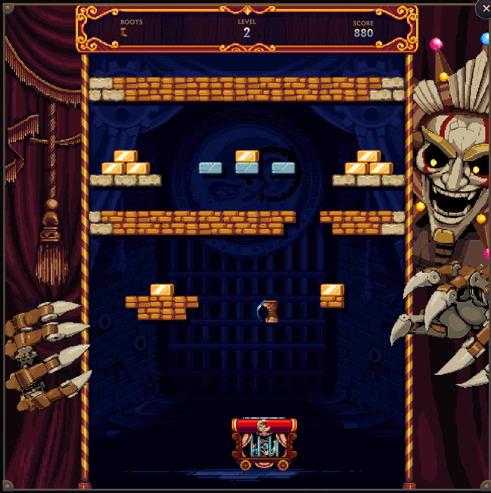

This is a mini game from dota called "Bootbreaker". The game is similar to "Brick breaker" where players control a paddle to bounce a ball and break bricks. The objective is to throw the "boot/ball" to upwards off the screen, not to break all the bricks. The game is played in a single-player mode, and the player must use their paddle to keep the ball in play while trying to hit the bricks. The game ends when the player loses all their lives or successfully throws the ball off the screen. Paddle here also means the cart that the player controls to bounce the ball.

Game control:

* A - Move paddle left
* D - Move paddle right
* Space: launch the boot/ball

At first, we can move the paddle around to choose the place to launch the boot/ball. After choosing by pressing Space, we can choose the direction to launch the boot/ball. Once the boot/ball is launched, it will bounce off the walls and bricks. The player must keep the boot/ball in play by moving the paddle left or right to prevent it from falling off the bottom of the screen.

Screenshots:

* 
* 
* 
* 
